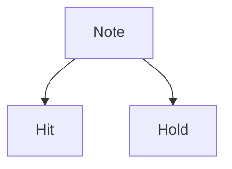

# Conventions

## Units

Unless specifically specified. The units used for the package are

| Unit of | Unit as          |
|---------|------------------|
| Time    | Milliseconds     |
| BPM     | Beats Per Minute |
| Column  | Integer from 0   |

There are multiple methods available in `reamber.base.RAConst` for conversion

- `hr_to_min(hours)`
- `hr_to_sec(hours)`
- `hr_to_msec(hours)`
- `min_to_hr(mins)`
- ...

## Map & MapSet

A MapSet is simply a collection of Maps.

## Notes

- A `Hit` is a tapped note (i.e. Rice).
- A `Hold` is a held note (i.e. Noodle).
- A `Note`  can be either a `Hit` or `Hold`.

## BPM Points

I don't use `TimingPoint` because it's confusing.

