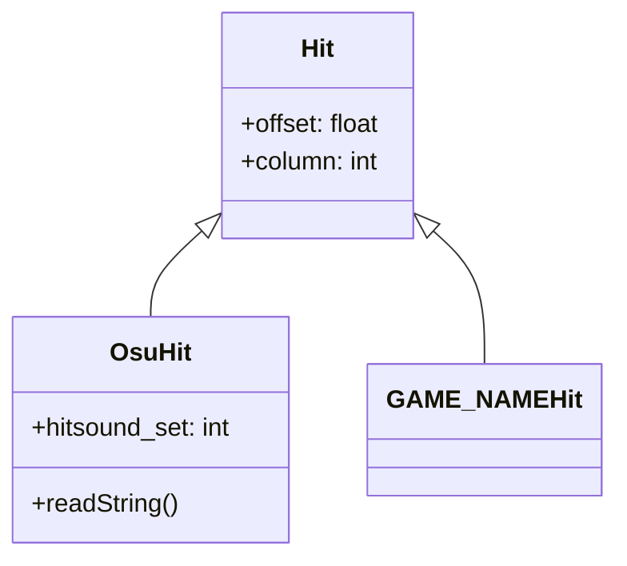
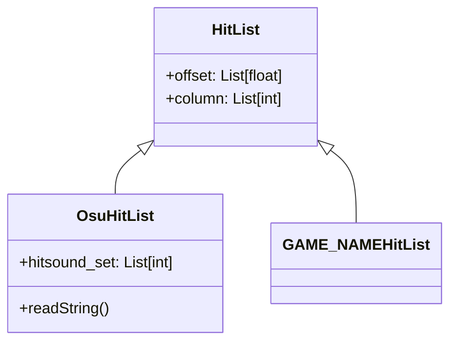

# Building Blocks of ReamberPy

All objects build on top of a `Base` class.

We illustrate the example with `OsuHit`, you can replace `GAME_NAME` with any
game name.

For example in the case of `Hit`:

We also have `HitList` which is a list of `Hit`s.

Thus, you can expect that `QuaHitList(...).offset` & `OsuHitList(...).offset`
to behave the same.

>`OsuHold(...).offset` will yield a single value.
>`OsuHoldList(...).offset` will yield a list of values

## Properties

Usually, if it exists, then it'll be implemented.

For example:

`OsuHold` will implement:

- `offset`, the LN Head
- `tail_offset`, the LN Tail
- `length`, the LN length
- `column`, the column of the note.

Accessed via `.___` syntax.

## Pandas-like Operations

A great feature of ReamberPy objects is that they can be broadcasted to much
like `pandas`.

For example

- `OsuHoldList(...).offset += 1000` will add 1 second to all objects
- `OsuBpmList(...).bpm += 100` will add 100 to all BPMs

In fact, the underlying data representation is pandas' `DataFrame`!.
Thus you can expect all the same operations to work.
