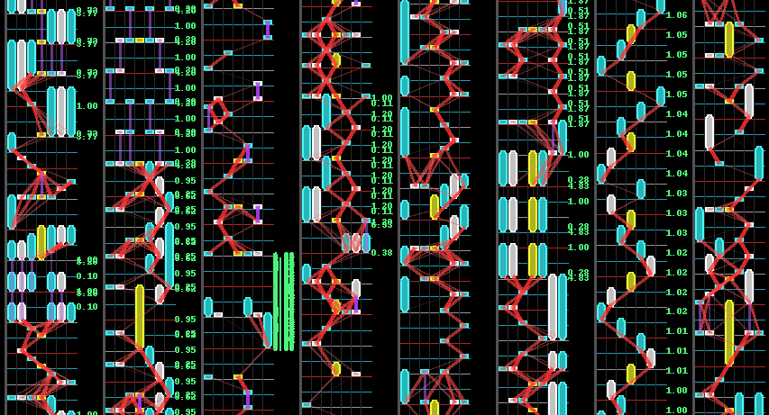

# Play Field

``PlayField`` generates an image from a map.



The `playField` implements image layers: notes, column lines, etc. separately.

This means you can pick & choose the elements to include

- ``PFDrawBpm()``
- ``PFDrawBeatLines()``
- ``PFDrawColumnLines()``
- ``PFDrawNotes()``
- ``PFDrawOffsets()``

## Usage

Firstly initialize the `PlayField` with a map

```py
from reamber.algorithms.playField import PlayField
from reamber.osu.OsuMap import OsuMap

m = OsuMap.read_file("...")

pf = PlayField(m=m, duration_per_px=5, padding=40) 
```

Then, **add** layers on top of it

```pycon
pf = (
    PlayField(m=m, duration_per_px=5, padding=40) +
    PFDrawBpm() +
    PFDrawBeatLines() +
    PFDrawColumnLines() +
    PFDrawNotes() +
    PFDrawOffsets()
)
```

Finally, once you're done, export it as an image.

```pycon
pf.export_fold(max_height=2000).save("saved_img.png")
```

- ``export_fold`` folds the image, so that it's not an extremely long image.
- ``export`` exports as is.

## Recipes

### Osu

```py
from reamber.osu.OsuMap import OsuMap
from reamber.algorithms.playField import PlayField
from reamber.algorithms.playField.parts import *

m = OsuMap.read_file("path/to/file.osu")
pf = (
    PlayField(m, padding=70)
    + PFDrawColumnLines()
    + PFDrawBeatLines()
    + PFDrawBpm(x_offset=30, y_offset=0)
    + PFDrawSv(y_offset=0)
    + PFDrawNotes()
)
pf.export_fold(maxHeight=1000).save("osu.png")
```

### SM

```py
from reamber.sm.SMMapSet import SMMapSet
from reamber.algorithms.playField import PlayField
from reamber.algorithms.playField.parts import *

s = SMMapSet.read_file("path/to/file.sm")
pf = (
    PlayField(s.maps[0])
    + PFDrawBeatLines([1])
    + PFDrawNotes()
)
pf.export_fold(max_height=2000).save("sm.png")
```

### Quaver

```py
from reamber.quaver.QuaMap import QuaMap
from reamber.algorithms.playField import PlayField
from reamber.algorithms.playField.parts import *

m = QuaMap.read_file("path/to/file.qua")
pf = (
    PlayField(m)
    + PFDrawColumnLines()
    + PFDrawBeatLines([1, 3, 6])
    + PFDrawNotes()
)
pf.export_fold(max_height=2000).save("qua.png")
```

### O2Jam

```py
from reamber.o2jam.O2JMapSet import O2JMapSet
from reamber.algorithms.playField import PlayField
from reamber.algorithms.playField.parts import *

s = O2JMapSet.read_file("path/to/file.ojn")
pf = (
    PlayField(s.maps[2], padding=40)
    + PFDrawColumnLines()
    + PFDrawBeatLines([1])
    + PFDrawBpm()
    + PFDrawNotes()
)
pf.export_fold(max_height=2000).save("o2j.png")
```
